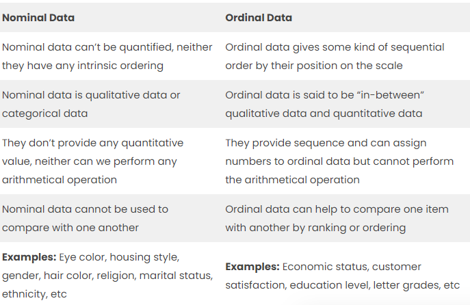
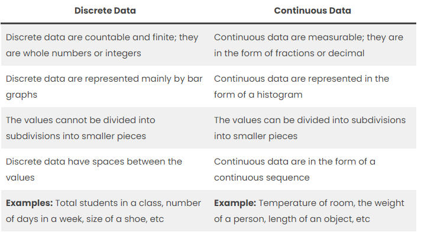
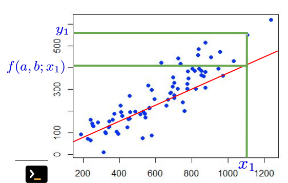
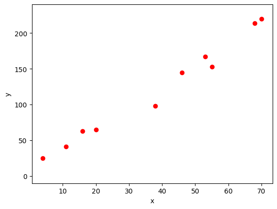
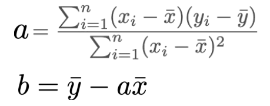
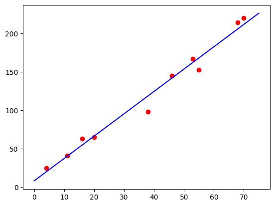
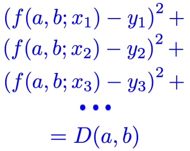

# Data Modelling

## Types of Data

### Qualitative or Categorical Data
Qualitative or Categorical Data is data that can’t be measured or counted in the form of numbers. 
These types of data are sorted by category, not by number. 

These data consist of audio, images, symbols, or text. 

Some examples:
* the gender of a person, i.e., male, female, or others.
* What language do you speak
* Favorite holiday destination
* Opinion on something (agree, disagree, or neutral)
* Colors

The Qualitative data are further classified into two parts :



#### Nominal Data
Nominal Data is used to label variables without any order or quantitative value. The color of hair can be considered nominal data, as one color can’t be compared with another color.
With the help of nominal data, we can’t do any numerical tasks or can’t give any order to sort the data. These data don’t have any meaningful order; their values are distributed into distinct categories.

Examples of Nominal Data :
* Colour of hair (Blonde, red, Brown, Black, etc.)
* Marital status (Single, Widowed, Married)
* Nationality (Indian, German, American)
* Gender (Male, Female, Others)
* Eye Color (Black, Brown, etc.)

#### Ordinal Data
Ordinal data have natural ordering where a number is present in some kind of order by their position on the scale. These data are used for observation like customer satisfaction, happiness, etc., but we can’t do any arithmetical tasks on them. 
Compared to nominal data, ordinal data have some kind of order that is not present in nominal data.  

Examples of Ordinal Data :
* When companies ask for feedback, experience, or satisfaction on a scale of 1 to 10 
* Letter grades in the exam (A, B, C, D, etc.)
* Ranking of people in a competition (First, Second, Third, etc.)
* Economic Status (High, Medium, and Low)
* Education Level (Higher, Secondary, Primary)

### Quantitative Data
Quantitative data can be expressed in numerical values, making it countable and including statistical data analysis. 
These kinds of data are also known as Numerical data. It answers the questions like “how much,” “how many,” and “how often.” 

Quantitative data can be used for statistical manipulation. 
These data can be represented on a wide variety of graphs and charts, such as bar graphs, histograms, scatter plots, boxplots, pie charts, line graphs, etc.

Examples of Quantitative Data : 
* Height or weight of a person or object 
* Room Temperature 
* Scores and Marks (Ex: 59, 80, 60, etc.)
* Time 

The Quantitative data are further classified into two parts :



#### Discrete Data
The term discrete means distinct or separate. The discrete data contain the values that fall under integers or whole numbers. 
The total number of students in a class is an example of discrete data. These data can’t be broken into decimal or fraction values.

The discrete data are countable and have finite values; their subdivision is not possible. 
These data are represented mainly by a bar graph, number line, or frequency table.

Examples of Discrete Data : 
* Total numbers of students present in a class 
* Cost of a cell phone 
* Numbers of employees in a company 
* The total number of players who participated in a competition 
* Days in a week

#### Continuous Data
Continuous data are in the form of fractional numbers. It can be the version of an android phone, the height of a person, the length of an object, etc. 
Continuous data represents information that can be divided into smaller levels. The continuous variable can take any value within a range. 

The key difference between discrete and continuous data is that discrete data contains the integer or whole number. 
Still, continuous data stores the fractional numbers to record different types of data such as temperature, height, width, time, speed, etc.

Examples of Continuous Data : 
* Height of a person 
* Speed of a vehicle 
* “Time-taken” to finish the work 
* Wi-Fi Frequency 
* Market share price

## Models

Normally, data is discrete and can be visualized as a scatter plot.

Frequently, models are given by continuous functions
* Example: continuous function of a variable f(x) can be represented in a graph as y = f(x)
* Example of a model: y = a x + b with parameters a and b determined from the data.

### Linear regression
1. Find a model (function) that represents (approximately) the data. 
2. Minimize the distance between a model and the data.




I have a model represented by the function $f(a, b; x) = ax + b$, where "a" and "b" are parameters that determine the shape of the function, and "x" is the input variable.

To evaluate the **distance** between the **model's prediction** and a **specific data point** (x1, y1), you can substitute "x1" and "y1" into the function f(a, b; x) and calculate the difference:

$Distance = f(a, b; x1) - y1 = (a * x1 + b) - y1$

"Distance" represents the difference between the model's prediction and a single data point. It is a measure of the deviation between the model's output and the actual value for that specific data point.


Now, given a set of data points ${(x1, y1), (x2, y2), ...}$, you can calculate the squared difference between the model's prediction and the actual value for each data point, and then sum them up. This can be expressed as:

$D(a, b) = (f(a, b; x1) - y1)^2 + (f(a, b; x2) - y2)^2 + ...$

In this expression, each term represents the squared difference between the model's prediction, $f(a, b; xi)$, and the corresponding actual value, yi, for each data point $(xi, yi)$. 
The square of the difference is used to ensure that both positive and negative differences contribute positively to the overall sum.

By minimizing the value of $D(a, b)$, you are effectively finding the values of parameters "a" and "b" that result in the best fit or approximation of the model to the given data points. 

$$
a = \frac{\sum_{i=1}^n (X_i - \bar{X})(Y_i - \bar{Y})}{\sum_{i=1}^n (X_i - \bar{X})^2}
$$

$$
b = \bar{y} - a \bar{X}
$$


#### In Python:

```python
# Importing necessary libraries
import numpy as np
import matplotlib
import matplotlib.pyplot as plt 
```

```python
# Creating arrays for x and y data points
x = np.array([55.0, 38, 68, 70, 53, 46, 11, 16, 20, 4])
y = np.array([153.0, 98, 214, 220, 167, 145, 41, 63, 65, 25])

# Creating a scatter plot using the x and y data
g = plt.scatter(x=x, y=y, color='red')

# Setting the y-axis limits of the plot
plt.ylim((-10, 240))

# Setting the labels for x and y axes
plt.xlabel('x')
plt.ylabel('y')

# Displaying the plot
plt.show()
```




```python
# Calculating a and b using the previous formula
def ajuste_lineal(x,y):
    a = sum(((x - x.mean())*(y-y.mean()))) / sum(((x-x.mean())**2))
    b = y.mean() - a*x.mean()
    return a, b

a, b = ajuste_lineal(x, y)
print('a =', a) # a = 2.905522724210283 
print('b =', b) # b = 8.39958420758822
```

```python
# Generate a range of x values for creating a continuous plot of the line
# linspace generates 100 equally spaced values between 0 and 75, inclusive.
xc = np.linspace(0, 75, 100)

# Use the equation of the line with the fitted coefficients obtained from the previous formula
# It calculates the corresponding y values for each x value 
yc = a * xc + b

# Plot the line
plt.plot(xc, yc, 'b')

# Plot the original data points
plt.scatter(x=x, y=y, color='red')

# Display the plot
plt.show()
```



## Curve fitting
Curve fitting refers to the process of finding a mathematical function that best fits a set of data points. In this case, we want to fit the curve without knowing the equations that would give us the parameters a and b of the function.

To achieve this, we need to define a distance function between the data points and and minimize it.



```python
def cuadratic_distance(x, y, a, b):
    D = a * x + b - y
    D2 = sum(D*D)
    return D2
```

In mathematics, to minimize a function means to find the value or values of the independent variable(s) that result in the smallest possible value of the function - in this case, a and b.

```python
# The function that I want to minimize
def line_distance(coefs): # Distancia a la recta
    an = coefs[0]
    bn = coefs[1]
    Dxy = cuadratic_distance(x, y, an, bn)
   return Dxy
```
The code minimize(line_distance, [1, 1]) is calling the minimize function to find the minimum value of the line_distance function, starting with an initial guess of [1, 1] for the coefficients of the line.

By providing line_distance as the first argument and [1, 1] as the initial guess for the coefficients, the minimize function will iteratively refine the coefficients to minimize the value returned by the line_distance function.

```python
from scipy.optimize import minimize
minimize(line_distance, [1, 1]) # [1, 1] is my initial guess for coefficients
```
