# Data Science

Data science is a field that involves analyzing and interpreting data to gain insights and make informed decisions. 
It uses techniques from statistics, mathematics, and computer science to extract meaningful information from data sets. 

Data scientists collect, clean, analyze, and visualize data to uncover non-obvious and useful patterns and trends from large datasets. 
The ultimate goal of data science is to use data to drive understanding, solve problems, and make data-driven decisions.

"Data Science is the art of turning data into actions."

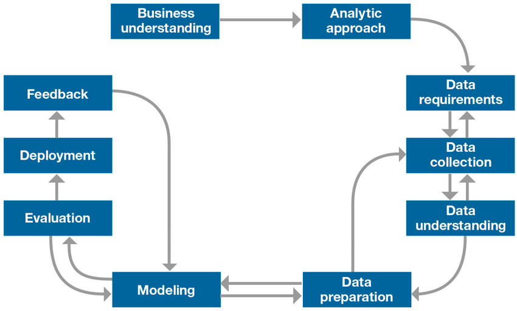

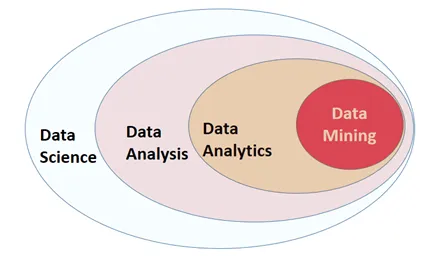

## Data
### Quantitive (numeric)
### Qualitative (categorical)
If I can't add something or can't get a meaningful result by adding or substracting the values of two variables, I am working with a categorical variable.
* I can't add cat + dog, female + male, married + single
* grades A, B and C can't be added until they are converted to numbers

Also, a categorical variable should divide the data into distinct groups or categories. 
Categorical variables typically have a limited number of unique values that define different groups or classes within the dataset.
* License plate numbers, although they may consist of letters and numbers, are not considered categorical variables because they do not represent distinct categories or groups. License plate numbers are typically used as unique identifiers rather than representing different groups or classes. 
* Emails. s. In most cases, analyzing or manipulating email addresses would involve tasks such as data validation, parsing, or extracting specific components (e.g., domain name, username) rather than treating them as categorical variables.
* ID numbers

Examples:
* hair color ("blonde", "brunette", "grey")
* cloud cover ("cloudy", "sunny", "partly cloudy")
* belief in life after death ("Yes", "No")
* In a football game ("Win", "Lose")
* Favourite artist ("Taylor Swift", "Coldplay")
* !! A variable using numbers as category labels is always a categorical variable

## Tidy Data
Tidy datasets provide a standardized way to link the structure of a dataset (its physical layout) with its semantics (its meaning).
* **Structure** is the form and shape of your data. In statistics, most datasets are rectangular data tables(data frames) and are made up of rows and columns.

* **Semantics** refers to the meaning of the data. Datasets consist of values, which can be either quantitative (numeric) or qualitative (categorical). These values are organized in two ways:

    * **Variables** — These are values that measure the same attribute across different units. For example, if you have a dataset of students, variables could be their age, test scores, or gender.
    * **Observations** — all values measured on the same unit across attributes. Continuing with the student example, observations would be individual students, and their attributes would be age, test scores, or gender.


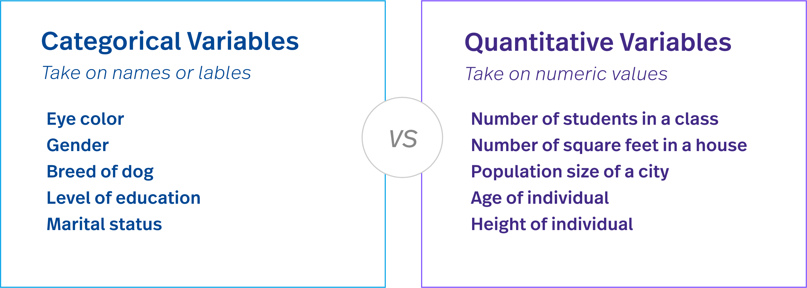

There are three interrelated rules which make a dataset tidy:
1. Each variable must have its own column. 
2. Each observation must have its own row. 
3. Each value must have its own cell.

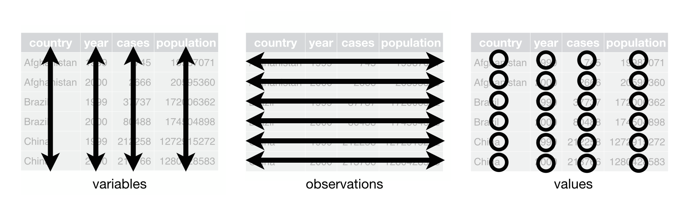

## Exploratory Data Analysis (EDA)
One of the initial steps in developing a data science project is understanding the data. 
For this purpose, a technique called Exploratory Data Analysis (EDA) is commonly used, where the data is explored and its main characteristics are summarized. 
The primary objective is to gain insights into the content of the data, to help frame the questions that will be asked and to propose possible paths to finding answers to those questions.

In this section, we will work with a widely used standard dataset in machine learning, which consists of information about housing in districts of the state of California, USA.

#### Set up the environment

```python
import os
import numpy as np

# For creating figures
import matplotlib as mpl
import matplotlib.pyplot as plt
mpl.rc('axes', labelsize=14)  # Set default label font size for plots
mpl.rc('xtick', labelsize=12)  # Set default x-axis tick font size for plots
mpl.rc('ytick', labelsize=12)  # Set default y-axis tick font size for plots

# Create a directory "imagenes" if it doesn't exist
PROJECT_ROOT_DIR = "."  # Root directory of the project
CHAPTER_ID = "01_AED"  # ID for the current chapter
IMAGES_PATH = os.path.join(PROJECT_ROOT_DIR, "imagenes", CHAPTER_ID)  # Path for saving images
os.makedirs(IMAGES_PATH, exist_ok=True)  # Create the directory if it doesn't exist

# A handy function to save images
def save_fig(fig_id, tight_layout=True, fig_extension="png", resolution=300):
    path = os.path.join(IMAGES_PATH, fig_id + "." + fig_extension)  # Path to save the figure
    print("Saving figure", fig_id)
    if tight_layout:
        plt.tight_layout()  # Automatically adjust subplot parameters to fit the figure area
    plt.savefig(path, format=fig_extension, dpi=resolution)  # Save the figure with specified resolution

# Ignore unnecessary warnings
import warnings
warnings.filterwarnings(action="ignore", message="^internal gelsd")  # Ignore specific warning message
```

#### Collecting the Data
The first step is to access the data.

```python
import pandas as pd

HOUSING_PATH = "./Data"  # Path to the housing dataset directory
HOUSING_FILE = "housing_mod.csv"  # Name of the housing dataset file

def load_housing_data(housing_path=HOUSING_PATH, housing_file=HOUSING_FILE):
    csv_path = os.path.join(housing_path, housing_file)  # Path to the housing dataset file
    return pd.read_csv(csv_path)  # Read the CSV file using pandas

housing = load_housing_data()  # Load the housing data from the CSV file
```

#### Some panda commands
```python
# Last 10 rows
housing.tail() # default 10

# First rows
housing.head() # default 10
housing.head(3)

# Show column names
print(housing.columns)

# Summary of the data
housing.info()

# For numerical columns: Count, Mean, Std, Min, 25%, 50%, 75%, Max
# For object/string columns: Count, Unique, Top, Freq
housing.describe()

# Show data of one column (in this case, ocean_proximity)
#print(housing['ocean_proximity']) (son iguales)
print(housing.ocean_proximity)

# Show values without repetition
#print(housing['ocean_proximity'].unique()) (son iguales)
print(housing.ocean_proximity.unique())

# How many times each value appears
print(housing.ocean_proximity.value_counts())

# Save data in a new dataframe
distritos_por_clase = housing.ocean_proximity.value_counts()

# The count values will be divided by the total number of observations, giving the proportion or percentage of each unique value.
# i.e. the 0.31 = 31% of all values is 'Tierra adentro'
print(housing.ocean_proximity.value_counts(normalize=True))

# Sort the DataFrame based on the values in the column in descending order.
housing.sort_values(by='median_income', ascending=False).head()

# Sort the DataFrame by the values in the first column first, and then by the values in the second column, 
# both in descending order.
housing.sort_values(by=['median_income', 'total_rooms'], ascending=False)

# Organize the data in the DataFrame into separate groups based on the unique values in the column.
grouped_housing = housing.groupby(by='ocean_proximity') 
grouped_housing.head(2) # return the first two rows of each group 

# Calculate the mean (average) value for each numerical column
housing.mean()
```
#### Plot dataframe
```python
# Plot
distritos_por_clase.plot(kind='bar', 
                         xlabel='Cercanía al océano',
                         ylabel='Cantidad de distritos')#, figsize=(8, 6))
```

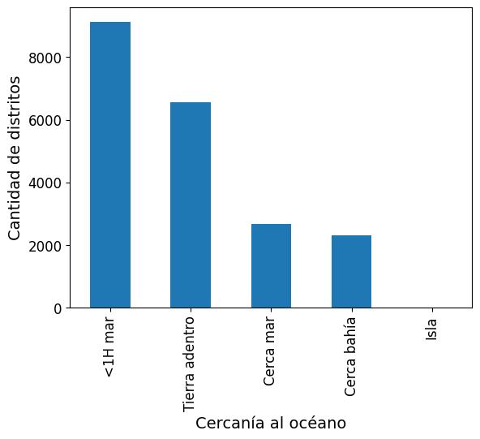

### Pearson correlation coefficient
A formal definition is beyond the scope of the course, but let's just say that the Pearson correlation coefficient between two variables X and Y, denoted as ρXY, is an estimator of the true correlation coefficient.

The Pearson coefficient increases when both variables deviate from their average values in the same direction and decreases if they move in opposite directions. 
Its extreme values are -1 and 1, representing perfect (anti-)correlation between the variables.

So, does zero mean that the variables are not correlated? ... No!

It's important to note that a Pearson correlation coefficient of zero does not necessarily imply the absence of any relationship between the variables. 
A correlation coefficient of zero indicates that there is no linear relationship between the variables, but it does not rule out the possibility of a non-linear relationship or other types of dependencies. 

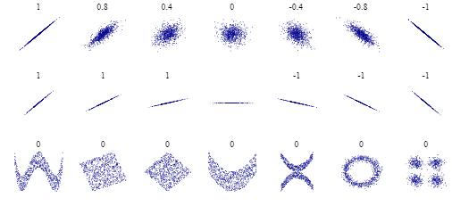

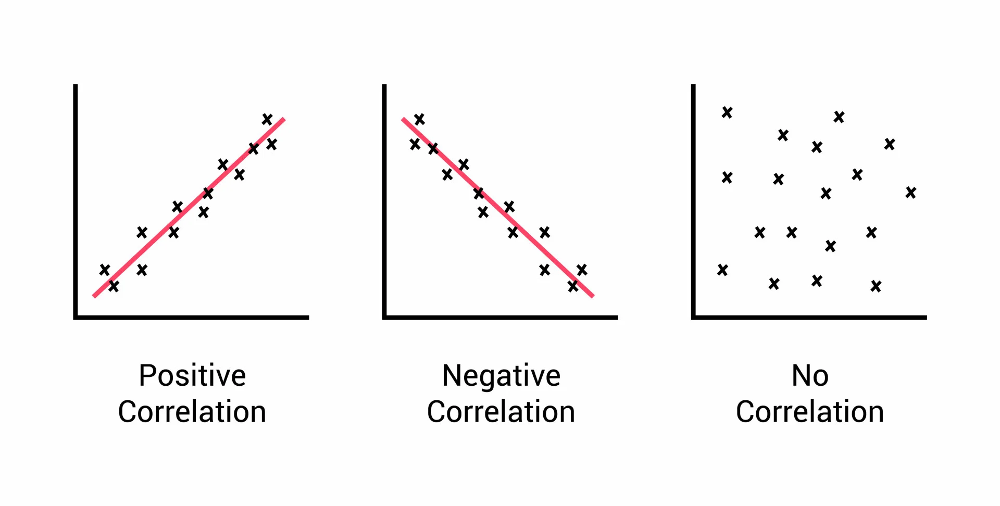

```python
# Calculate the correlation matrix of the housing dataset
# The correlation matrix is a square matrix that shows the pairwise correlations between all the columns (variables) in the dataset. 
# Each element in the matrix represents the correlation coefficient between two variables.
corr_matrix = housing.corr()

plt.figure(figsize=(8, 8))  # Create a new figure with a specified size

plt.imshow(corr_matrix)  # Display the correlation matrix as an image

# Set the x-axis tick labels with the column names of the housing dataset
xt = plt.xticks(np.arange(9), housing.columns[:-1], rotation=45, ha='right', va='top')

# Set the y-axis tick labels with the column names of the housing dataset
yt = plt.yticks(np.arange(9), housing.columns[:-1], rotation=0, ha='right', va='center')

# Add a colorbar to represent the values of the Pearson correlation coefficient
plt.colorbar(label='Pearson CC')
```

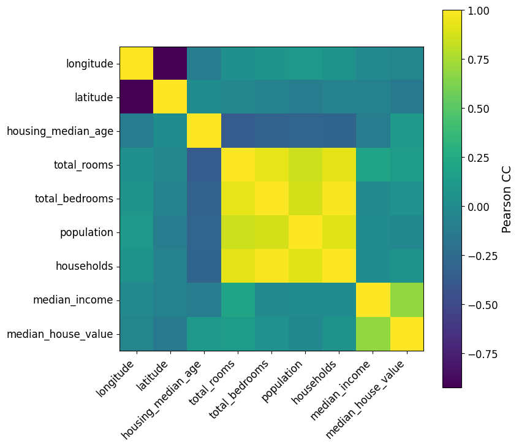

## Graphs

### Box plots

```python
fig = plt.figure(figsize=(12, 6))  # Create a figure with a size of 12x6 inches
ax = fig.add_subplot(111)  # Add a single subplot to the figure

categories = housing.ocean_proximity.unique()  # Get the unique categories in the 'ocean_proximity' column

data = housing.groupby('ocean_proximity').median_house_value.apply(np.array)  # Group the 'median_house_value' column by 'ocean_proximity' and convert to arrays

ax.boxplot(data, showmeans=True)  # Create a box plot of the data, showing the means

ax.xaxis.set_ticklabels(data.index)  # Set the tick labels on the x-axis to the category names

ax.set_ylabel('Median House Value', fontsize=16)  # Set the label for the y-axis

plt.show()
# The code above creates a box plot to visualize the distribution of median house values for each category in 'ocean_proximity'.
# Each box represents the interquartile range (IQR) of the data, with the line inside the box indicating the median.
# The whiskers extend to the minimum and maximum values, and the dots represent outliers.
# The means are shown as markers inside each box.
```

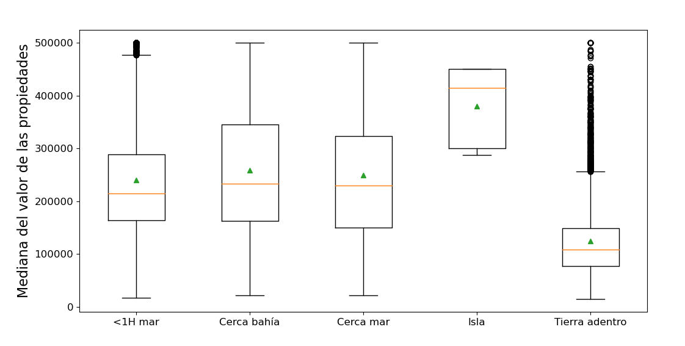


### Violin plots
Violin plots are a useful way to explore the distribution of data across different categories. 
A violin plot displays the distribution of a variable using a smoothed density estimation technique. 
It provides insights into the shape, spread, and skewness of the data, making it effective for visualizing relationships between variables and categories.

```python
fig = plt.figure(figsize=(12, 6))  # Create a figure with a size of 12x6 inches
ax = fig.add_subplot(111)  # Add a single subplot to the figure

categories = housing.ocean_proximity.unique()  # Get the unique categories in the 'ocean_proximity' column

data = housing.groupby('ocean_proximity').median_house_value.apply(np.array)  # Group the 'median_house_value' column by 'ocean_proximity' and convert to arrays

ax.violinplot(data, showextrema=True, showmeans=True, points=1000)

ax.xaxis.set_ticklabels(data.index)  # Set the tick labels on the x-axis to the category names

ax.set_ylabel('Median House Value', fontsize=16)  # Set the label for the y-axis

plt.show()

# Violin plots are similar to box plots but also display the density estimation of the data, providing a smooth representation of the distribution.
# The 'showextrema=True' parameter shows the minimum and maximum values, and 'showmeans=True' displays the means.
# The 'points=1000' parameter determines the number of points used to compute the density estimation.
```

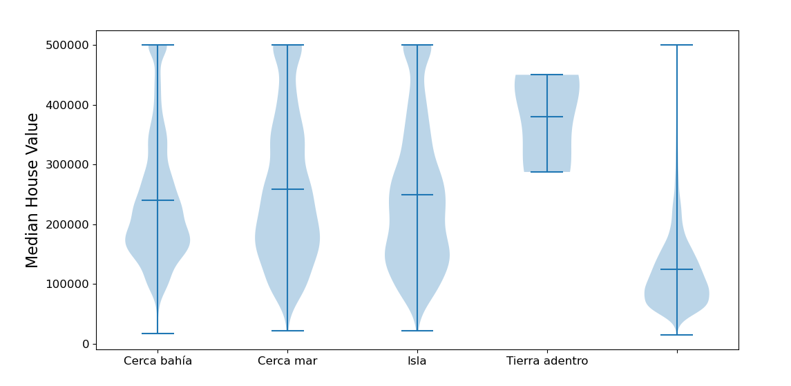

### Correlation Plots (Corner Plots)
Corner plots, also known as scatterplot matrices or pairwise scatterplots, are visualizations that show the relationships between pairs of variables in a dataset. 
It allows us to examine the correlation or association between multiple variables simultaneously.

We discussed the Pearson coefficient to understand the (linear) correlation between features. 
We can also use a visualization tool to see how pairs of features are related.

One simple way to do this is by using the scatter_matrix function from pandas.plotting.

```python
# Generate scatterplot matrix
axes = pd.plotting.scatter_matrix(housing.iloc[::20], figsize=(12, 12), alpha=0.5, hist_kwds={'bins': 25})

# Rotate x-axis and y-axis labels for better readability
for ax in axes.flatten():
    ax.xaxis.label.set_rotation(45)  # Rotate x-axis label by 45 degrees
    ax.xaxis.label.set_ha('right')  # Align x-axis label to the right
    ax.yaxis.label.set_rotation(0)  # Rotate y-axis label by 0 degrees (horizontal)
    ax.yaxis.label.set_ha('right')  # Align y-axis label to the right
```

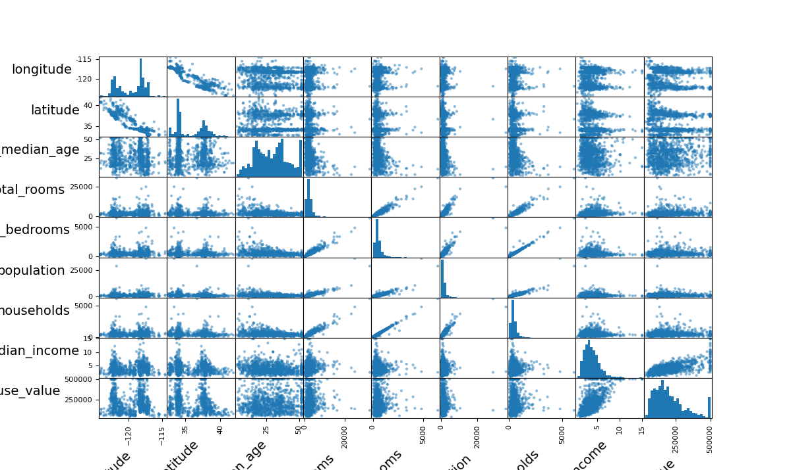

### Scatter Plots
```python
scatter = plt.scatter(housing.longitude, housing.latitude)
plt.xlabel('Longitud')
plt.ylabel('Latitud')
```
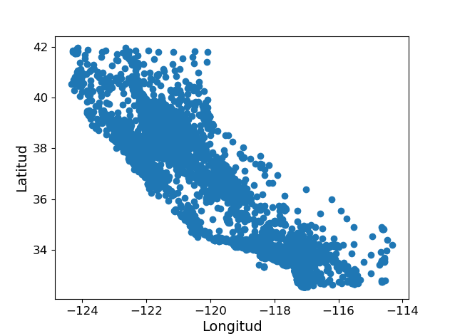

```python
# Create a new figure with a size of 10x8 inches
fig = plt.figure(figsize=(10, 8))

# Add a single subplot to the figure
ax = fig.add_subplot(111)

# Define the feature to be used for color coding the scatter plot
color_feature = 'total_bedrooms'

# Define the feature to be used for sizing the scatter plot markers
size_feature = 'total_rooms'

# Create a scatter plot of longitude vs. latitude
# Set the transparency (alpha) of the markers to 0.4
# Color the markers based on the 'color_feature' using the 'jet' color map
# Size the markers based on the 'size_feature' divided by 300
# Provide a label for the size feature to be used in the legend
scat = plt.scatter(housing.longitude, housing.latitude, alpha=0.4, 
                   c=housing[color_feature], cmap='jet',
                   s=housing[size_feature]/300, label=size_feature)

# Add a colorbar to the plot and label it with the color feature name
plt.colorbar(scat, label=color_feature)

# Set the x-axis label
ax.set_xlabel('Longitude [degrees]', fontsize=16)

# Set the y-axis label
ax.set_ylabel('Latitude [degrees]', fontsize=16)

# Add a legend to the plot
leg = ax.legend()
```
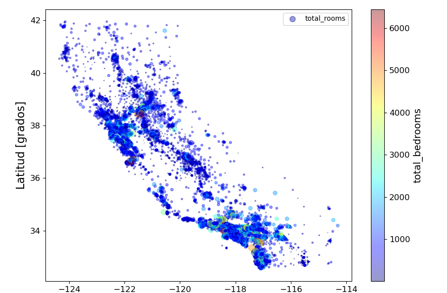