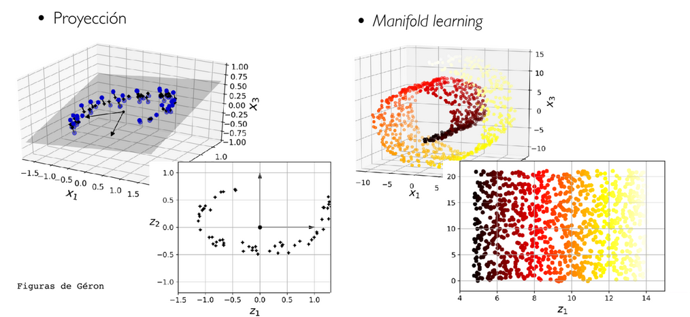

# Dimensionality reduction

Dimensionality reduction refers to the process of reducing the number of features or variables 
in a dataset while preserving its important structure and information. 
The goal is to retain as much relevant information as possible while removing irrelevant or redundant features.

It is commonly used in machine learning and data analysis to handle high-dimensional data and to simplify complex datasets.

### Why reduce
One may want to reduce the dimensionality for various reasons:

* **Visualization**: to create visualizations of the data. 
* **Space-saving**: to reduce the storage space required for the data (compression). 
* **Computational efficiency**: to reduce the computational costs of training algorithms by reducing the number of features. 
* **Performance improvement**: to improve the performance of a model by increasing the signal-to-noise ratio and the density of data points (avoiding the curse of dimensionality).

### How to
The problem of reducing the dimensionality of features while retaining most of the information is known as dimensionality reduction, 
and there are two main approaches to tackle it:

1. **Projection**: Projecting the high-dimensional space onto a lower-dimensional plane, eliminating the orthogonal features. 
    * the most well-known algorithm is Principal Component Analysis (PCA). It identifies the directions in the data that contain the most variation and projects the data onto those directions, effectively reducing the dimensionality.
 
2. **Manifold Learning**: Learning the geometry of a lower-dimensional manifold and projecting the data onto it.



#### Principal Component Analysis (PCA)
The goal of Principal Component Analysis (PCA) is to find the directions along which to project the data in order 
to minimize the loss of information when reducing the dimensionality.
It retains the data in the direction of maximum variance. 

The main purpose of Principal Component Analysis (PCA) is to find the optimal set of axes onto 
which the available data can be projected. Each of these axis directions is called a **principal component**.

In PCA, the selection of the most important axes is based on their **variance**. 
* The first principal component is the direction that contains the most variance in the data. 
* Other directions are found (as many as the number of dimensions or features in the dataset) under the condition that each successive component retains as much of the remaining variance as possible and is orthogonal to all previous components.

In other words, the algorithm fits an ellipsoid to the data and then rotates the axes to align with the principal axes of the ellipsoid. 
The rotated axes are the principal components (this is equivalent to finding an orthogonal basis in which the covariance matrix is diagonalized).

[Ejemplo de uso de PCA](../Exercises/03/pca.py)

##### Normalizing the data

```python
from sklearn.preprocessing import StandardScaler
from sklearn.decomposition import PCA

scaler = StandardScaler() # Instantiate the StandardScaler object

X_scaled = scaler.fit_transform(X # Scale the data using the StandardScaler

# The data is standardized, meaning it is centered around 0 and has a standard deviation of 1

pca = PCA(n_components=1) # Instantiate the PCA object with the desired number of components

X_pca = pca.fit_transform(X_scaled) # Perform PCA on the scaled data

# The PCA transformation reduces the dimensionality of the data to the specified number of components
```

