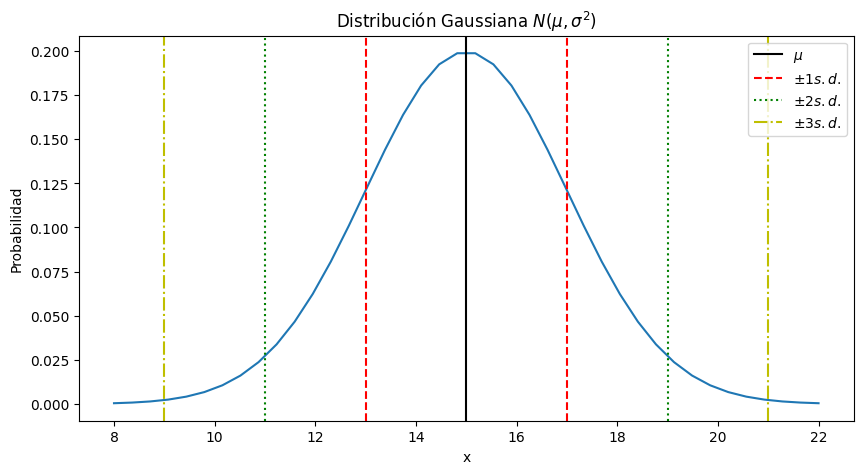

# Probability

Probability is a numerical concept used to measure the chance of any specific event or outcome occurring. 

The value of the probability ranges from 0 to 1. If the value is closer to 1, then we can assume it has a high probability to occur.

Nomenclature: random, probabilistic, stochastic

Sources of uncertainty:
* Incomplete observability 
* Incomplete modeling 
* Unpredictability (e.g., mood)
* Inherent stochasticity (e.g., Quantum Mechanics)

Simple probabilities:
* **Binary**: Probability of something happening 
* **Discrete** or Integer probability: more studied, intuitive
* **Continuous** probability: more useful, realistic, common


## Binomial Distribution


#### Mean, Median, Mode & Range


* **Mean**: The arithmetic average of all the numbers
* **Median**: The value in the center when the numbers are arranged from least to greatest.  It is the value that divides the data into two equal-sized halves.
* **Mode**: The most commonly appearing value. It represents the value that occurs with the highest probability.
* **Range**: The difference between the largest and smallest number. 

```python
import numpy as np
import statistics
import pandas as pd
from scipy import stats

# Sample data
data = [2, 4, 6, 8, 10]

# Mean
mean_np = np.mean(data)
mean_stats = statistics.mean(data)
mean_pd = pd.DataFrame(data).mean()

# Median
median_np = np.median(data)
median_stats = statistics.median(data)
median_pd = pd.DataFrame(data).median()

# Mode
mode_stats = statistics.mode(data)
mode_scipy = stats.mode(data)
mode_pd = pd.DataFrame(data).mode()
```

## Variance and Standard Deviation

$$\text{Var}(X) = \frac{1}{n}\sum_{i=1}^{n}(x_i - \bar{x})^2$$

$$\text{SD}(X) = \sqrt{\text{Var}(X)} = \sqrt{\frac{1}{n}\sum_{i=1}^{n}(x_i - \bar{x})^2}$$

```python
import numpy as np
import statistics
import pandas as pd

# Sample data
data = [2, 4, 6, 8, 10]

# Variance
variance_np = np.var(data)
variance_stats = statistics.variance(data)
variance_pd = pd.DataFrame(data).var()

# Standard Deviation
std_np = np.std(data)
std_stats = statistics.stdev(data)
std_pd = pd.DataFrame(data).std()
```

## Quantiles
Quantiles are values that divide a dataset into equal fractions or portions based on the probability distribution of the data. 
They represent specific points within the dataset and are often used to understand the distribution and characteristics of the data.

For example, the median is a commonly used **quantile** that divides the dataset into two equal halves. It represents the middle value when the data is sorted in ascending or descending order.

Quantiles can be any fraction or percentage of the data, such as quartiles (dividing the data into four equal parts) or percentiles (dividing the data into one hundred equal parts).

For instance, the first quartile (Q1) represents the value below002ow which 75% of the data falls.

**Quartiles**
```python
import numpy as np
import statistics
import pandas as pd

# Sample data
data = [2, 4, 6, 8, 10]

# First Quartile (Q1)
q1_np = np.percentile(data, q=25)
q1_stats = statistics.quantiles(data, n=4)[0]
q1_pd = pd.DataFrame(data).quantile(q=0.25)

# Third Quartile (Q3)
q3_np = np.percentile(data, q=75)
q3_stats = statistics.quantiles(data, n=4)[-1]
q3_pd = pd.DataFrame(data).quantile(q=0.75)

# Quantile
quantile_np = np.percentile(data, q=50)
quantile_stats = np.quantile(data, q=0.5)
quantile_pd = pd.DataFrame(data).quantile(q=0.5)
```


**Percentiles**

The percentile is a measure of position used in statistics that indicates, once the data is sorted from smallest to largest, 
the value of the variable below which a given percentage of observations falls within a group. 

For example, the 20th percentile is the value below which 20% of the observations are found, and the remaining 80% are greater.

We want to calculate the 98th percentile, which means we want to find the value of x above which 98% of the data lies.

```python
value = mi_gaussiana.ppf(0.98)
value = norm.ppf(0.98, loc=15, scale=2)  # ppf = Percent point function
                                        # It returns the x value above which 98% of the data lies

print(norm.isf(0.02, loc=15, scale=2))  # Inverse survival function
                                        # It returns the value of x below which 2% of the data lies
```

## Box plot


## Probability Density Functions


### Normal or Gauss Distribution

A distribution is called Gaussian or Normal distribution when it follows the shape of a bell curve. It is a continuous probability distribution that is symmetric around its mean.

The Gaussian distribution is defined by two parameters:

* Mean (μ): It represents the center or average value of the distribution. 
* Standard Deviation (σ): It indicates the spread or dispersion of the distribution. A larger standard deviation leads to a wider spread of data.

Examples:
* Physical measurements of the human body in a population (height, weight, etc.). 
* Quality measurements in many industrial processes. 
* Errors in astronomical observations.

The Central Limit Theorem states that when the results of a dataset are influenced by a large combination of independent factors that contribute to the overall outcome, and each individual factor has a minor effect compared to the whole, it is expected that the results of that dataset will follow a normal distribution.

In other words, the Central Limit Theorem suggests that under certain conditions, when independent random variables are summed or combined, their distribution tends to approach a normal distribution regardless of the original distribution of the individual variables. 

```python
import numpy as np

mean = 0  # Mean of the Gaussian distribution
std_dev = 1  # Standard deviation of the Gaussian distribution
size = 100  # Number of random numbers to generate

random_numbers = np.random.normal(mean, std_dev, size)
```


## In Python

### Generating random numbers

1. Every time a different number
```python
import random

# Random number between 1 and 6
random.randint(1, 6)
```
2. Seed function
Seed function is used to save the state of a random function, so that it can generate same random numbers 
on multiple executions of the code on the same machine or on different machines (for a specific seed value). 

```python
import random

# Fixed seed
random.seed(42) # I can choose any number

# Generating random number between 1 and 6
random.randint(1, 6)
```

### Generala servida
What's the probability of rolling 5 dice and they all show the same number?

The probability of getting all 5 numbers the same is: $(1/6) * (1/6) * (1/6) * (1/6) * (1/6) = (1/6)^5$

However, since we can achieve a "generala" with any of the 6 possible numbers, the probability of a "generala servida" is 6 * (1/6)^5 = (1/6)^4 ≈ 0.00077 = 0.077%

We can attempt to calculate the probability of a "generala servida" by conducting a numerical experiment of rolling dice and observing the frequency at which we obtain it.
```python
import random

#Estimate the probability of "generala servida"
N = 100000 # Number of experiments
successes = 0
for i in range(N):
    # Generate a list of 5 dice rolls using random.randint(1, 6)
    # Each dice roll will be a random number between 1 and 6 (inclusive)
    dice = [random.randint(1, 6) for k in range(5)]
    
    # dice is a list containing the results of rolling 5 dice.
    # dice[0] is the value of the first dice roll (first dice list element)
    # dice.count(dice[0]) counts the number of occurrences of dice[0] in the dados list.
    # If dados.count(dados[0]) is equal to 5, it means that all the dice rolls in the list have the same value.
    if dice.count(dice[0]) == 5:
        successes += 1

print("The probability of a 'generala servida' is", successes/N)
print("The exact probability is", 1/6**4)

# As we increase the number of experiments N, the result will increasingly resemble the calculated "theoretical" value.
```

# Distributions

### Coin toss
Now let's consider a problem of flipping coins, where the outcome is binary, either 0 or 1 (heads or tails). What is the probability of getting a certain number n of heads when flipping a coin 10 times? 

We will count how many times n heads occur when flipping the coin 10 times, for all possible values of n. 

What do we expect? To obtain a distribution of values! And we expect this distribution to have a mode at 5, right?

#### Counting heads

```python
import random

N = 100000  # Number of experiments
results = []  # List to store the results

# Perform N experiments
for i in range(N):
    heads = 0  # Counter for the number of heads

    # Flip the coin 10 times
    for i in range(10):
        res = random.randint(0, 1)  # Generate a random number (0 for tails, 1 for heads)
        if res == 1:
            heads += 1  # Increment the counter if it's a head

    results.append(heads)  # Append the final count of heads to the results list
```

#### Histogram with results
```python
import matplotlib.pyplot as plt

# Plot the histogram of the results
plt.figure()
plt.hist(results, bins=11) 
plt.xlabel('# of heads')  
plt.ylabel('count')  
plt.show()  
```


#### Statistical indicators
```python
import numpy as np
from scipy import stats
import matplotlib.pyplot as plt

# Mean or average
print('Promedio:', np.mean(results)) # 5.00313

# Median or middle value
print('Mediana:', np.median(results)) # 5.0

# Mode or most frequent value
print('Moda:', stats.mode(results).mode) # 5

# Variance
print('Varianza:', np.var(results)) # 2.4992402031000003

# Standard deviation
print('Desvío estándar:', np.std(results)) # 1.5808985429495468
```
As the distribution is symmetric, the mean and median coincide.

Furthermore, since it is unimodal and symmetric, we have that mean == median == mode (a distribution is multimodal if it has multiple peaks).

```python
print('First quartile (Q1) (Q1):', np.quantile(results, 0.25)) # 4.0

print('Second quartile (Q2) == Median:', np.quantile(results, 0.5)) # 5.0

print('Third quartile(Q3):', np.quantile(results, 0.75)) # 6.0

print('0.93 quantile:', np.quantile(results, 0.93)) # 7.0
```

#### Box plot
```python
plt.figure()
plt.boxplot(results)
plt.show()
```


We can see that the code considers the results of 0 and 10 as outliers. By default, the length of the whiskers in a boxplot extends only up to 1.5 times the interquartile range (Q3-Q1) beyond the central box. In other words:


Upper limit: Q3 + 1.5 * (Q3-Q1)
Lower limit: Q1 - 1.5 * (Q3-Q1)

We can modify this value, 1.5, using the whis parameter.

```python
plt.figure()
plt.boxplot(resultados, whis=2) 
plt.show()
```


#### Probability Density Function (PDF)

```python
# Create a list to represent the number of heads (0 to 10)
n_heads = [i for i in range(11)] # possible numbers of heads that can be obtained from 1 to 10

head_counts = []  # Empty list to store the count of heads

for nh in n_heads:
    head_counts.append(results.count(nh))  # Count how many times each number of heads appears in the 'resultados' list and add it to 'head_counts'

print(head_counts)  #  frequency or count of each possible number of heads obtained in the coin tosses
# [96, 956, 4396, 11496, 20932, 24409, 20420, 11766, 4426, 1016, 87]
```
```python
prob_heads = np.array(head_counts) / sum(head_counts) # casos favorables / casos totales
print(prob_heads) # array([0.00096, 0.00956, 0.04396, 0.11496, 0.20932, 0.24409, 0.2042 , 0.11766, 0.04426, 0.01016, 0.00087])
```
```python
plt.figure()
plt.bar(n_heads, prob_heads)
plt.show()
```

The sum of each bin (areas) is 1.


The hist function in matplotlib can automatically create a probability density by using the density=True option. 

By setting density=True, the histogram will display the probability density rather than the raw counts. 
This means that the heights of the histogram bars will represent the probability density of each bin, taking into account both the total number of events and the width of each bin.

```python
plt.figure()
plt.hist(resultados, bins=11, density=True) 
plt.show()
```


##### Comparing to Binomial Distribution


* p = q = 1/2 (because head and tails have the same probability). 
* N = 10 (because we flip the coin 10 times).
* n = # of heads

```python
factorial(10) / (factorial(n) * factorial(10-n)) * (1/2)**n * (1/2)**(10-n)
```

```python
from math import factorial

def prob_n_heads(n):
    """Probability of getting n heads in 10 coin tosses"""
    return (1/2)**10 * factorial(10)/(factorial(10-n)*factorial(n)) #binomial distribution formula

prob_heads_theory = [prob_n_heads(nc) for nc in n_heads]

# Providing starting points of the bins to the histogram to center it on the numbers
bin_edges = np.linspace(0.5, 10.5, 11)

plt.figure()
plt.hist(results, bins=bin_edges, density=True, label='Experimental')
plt.plot(n_heads, prob_heads_theory, color='r', label='Theoretical')
plt.legend()
plt.show()
```


**Expected value (Esperanza = n * p)**

```python
expected_value = 0
for i, prob in enumerate(prob_caras_teorico):
    # Summing number of heads * probability
    expected_value += n_caras[i] * prob

print(expected_value) # 5.0
```
### Dices product - non symmetric
Let's consider the product of the outcomes of two six-sided dice. The results can range from 1 (1x1) to 36 (6x6):

```python
N_d = 100000 # number of experiments
results_d = [] # list to store results
random.seed(4)

for i in range(N_d):
    product = random.randint(1, 6) * random.randint(1, 6)
    results_d.append(product) 
```

```python
plt.figure()
plt.hist(results_d, bins=7)
plt.xlabel('Product')
plt.ylabel('Count')
plt.show()
```


```python
print('Mean:', np.mean(results_d)) # 12.22194
print('Median:', np.median(results_d)) # 10.0
print('Mode:', stats.mode(results_d).mode) # 6
```
```python
plt.figure()
plt.boxplot(results_d)
plt.show()
```


### Normal or Gaussian Distribution

To study a Gaussian distribution, we will plot a normal distribution with a mean of 15 and variance of 4 (which corresponds to a standard deviation of 2).

```python
from scipy.stats import norm
mu=15.0 # Mean of the Gaussian distribution
sigma=2.0 # Standard deviation of the Gaussian distribution
mi_gaussiana=norm(loc=mu,scale=sigma)

x = np.linspace(8.0,22.0,40) # Range of values for x-axis

plt.figure(figsize = (10, 5))
plt.plot(x,mi_gaussiana.pdf(x))
plt.title(f"Distribución Gaussiana $N(\mu,\sigma^2)$")
plt.xlabel('x')
plt.ylabel('Probabilidad')
plt.show()
```


```python
plt.figure(figsize = (10, 5))
plt.plot(x,mi_gaussiana.pdf(x))

# Mark mean, mean ± 1 std_dev, mean ± 2 std_dev
plt.axvline(mu,color='black',linestyle='solid',label='$\mu$')
plt.axvline(mu-sigma,color='r',linestyle='dashed',label='$\pm 1 s.d.$')
plt.axvline(mu+sigma,color='r',linestyle='dashed')
plt.axvline(mu-2.0*sigma,color='g',linestyle='dotted',label='$\pm 2 s.d.$')
plt.axvline(mu+2.0*sigma,color='g',linestyle='dotted')
plt.axvline(mu-3.0*sigma,color='y',linestyle='-.',label='$\pm 3 s.d.$')
plt.axvline(mu+3.0*sigma,color='y',linestyle='-.')

plt.xlabel('x')
plt.title(f"Distribución Gaussiana $N(\mu,\sigma^2)$")
plt.xlabel('x')
plt.ylabel('Probabilidad')
plt.legend(loc='upper right')
plt.show()
```



```python
Nexp = 1000  # Number of measurements to generate
mediciones = mi_gaussiana.rvs(Nexp)  # Generate Nexp random samples from the Gaussian distribution

bins = np.arange(5, 25, 1.0)  # Define the bin edges for the histogram

plt.figure(figsize=(10, 5))  # Create a figure with a specific size

# Plot the histogram
plt.hist(mediciones, bins=bins, color='darkmagenta', alpha=0.8)

plt.xlabel('$x$')  # Set the x-axis label
plt.ylabel('$N_{\text{eventos}}$')  # Set the y-axis label
plt.title('Histograma para ' + str(Nexp) + ' mediciones')  # Set the plot title

plt.show()  # Display the plot
```


##### Unpacking the histrogram
By unpacking the histogram results, you can access and analyze the individual components, such as bin edges and event counts, allowing for further analysis or calculations based on the histogram data.

```python
bins = np.arange(5, 25, 1.0)  # Define the bin edges for the histogram

plt.figure(figsize=(10, 5))

# Compute the histogram and unpack the results
binned_data, hist_bins, pp = plt.hist(mediciones, bins=bins, color='darkmagenta', alpha=0.8)

plt.xlabel('$x$')
plt.ylabel('$N_{\text{eventos}}$')
plt.title('Histograma para ' + str(Nexp) + ' mediciones')
plt.show()

# Print the bin edges and event counts
print(hist_bins)
print(binned_data)

# Calculate the integral under the curve (total number of events)
print()
print('Número total de eventos: ', np.sum(binned_data))
```


```python
Nexp = 10
mediciones = mi_gaussiana.rvs(Nexp)  # Generate Nexp random data points from the Gaussian distribution

bins = np.arange(5, 25, 1.0)  # Define the bin edges for the histogram

plt.figure(figsize=(10, 5))

# Plot the histogram with density=True to normalize the histogram and make it a probability density
plt.hist(mediciones, bins=bins, color='darkmagenta', alpha=0.8, density=True)

# Plot the probability density function (PDF) of the Gaussian distribution
plt.plot(x, mi_gaussiana.pdf(x), color='black')

plt.xlabel('$x$')
plt.ylabel('$N_{\text{eventos}}$')
plt.title('Histograma para ' + str(Nexp) + ' mediciones')
plt.show()
```


##### Probabilities

Going back to the Gaussian probability distribution function, let's calculate the percentage of events that fall within ± 1 standard deviation. 

To do this, we need to remember that the probability of x being between two values is the area under the curve of the PDF (Probability Density Function) between those two values. 
* Mathematically, this area is often represented by a symbol resembling a distorted "S" (and the calculation of the area is called "integration"). 
* In Python, the area can be calculated using the "quad" function. 

In summary, the probability of having the variable x within ± 1 standard deviation, i.e., between μ - σ and μ + σ, is written and calculated as:


```python
from scipy.integrate import quad

# Define the lower and upper limits of integration
x_lower = mu - sigma  # Lower limit
x_upper = mu + sigma  # Upper limit

# Use quad function to calculate the integral
# mi_gaussiana.pdf is the probability density function (PDF) of the Gaussian distribution
# x_lower and x_upper are the limits of integration
val, abserr = quad(mi_gaussiana.pdf, x_lower, x_upper)

# val represents the estimated value of the integral, which corresponds to 
# the probability of the variable x being within ± 1 standard deviation.
# abserr represents the absolute error of the estimation.

# Print the probability value within the specified range
print(val) # 0.682689492137086
           # That shows that the region of x between μ - σ and μ + σ contains 68% of the probability.
```

**Probability of having values under 13:**


```python
x_lower = -np.inf  # Lower limit (negative infinity)
x_upper = 13  # Upper limit

val, abserr = quad(mi_gaussiana.pdf, x_lower, x_upper)
print(val)

# We can also use the sf from Scipy
print(mi_gaussiana.cdf(13))  # Cumulative density function CDF
```

**Probability of having values above 18:**


```python
x_lower = 18  # Lower limit
x_upper = np.inf  # Upper limit (infinity)

val, abserr = quad(mi_gaussiana.pdf, x_lower, x_upper)
print(val)

# We can also use the sf from Scipy
print(mi_gaussiana.sf(18))  # Survival function = 1 - cumulative density function
```

#### Cumulative Density Function (CDF) and Survival Function

The CDF gives us the probability of a random variable being less than or equal to a certain value, while the Survival Function gives us the probability of a random variable being greater than a certain value.

1. **Cumulative Distribution Function (CDF)**: The Cumulative Distribution Function is a function that tells us the probability of a random variable being less than or equal to a specific value. 
In other words, it gives us the cumulative probability up to that value. 

    For example, if we have a CDF value of 0.8 at x = 5, it means that there is an 80% probability that the random variable will be less than or equal to 5.

2. **Survival Function:** The Survival Function is the complement of the CDF. It represents the probability of a random variable being greater than a specific value. 
In other words, it gives us the probability of survival beyond that value. 

    For example, if the survival function value at x = 5 is 0.2, it means that there is a 20% probability of the random variable being greater than 5.