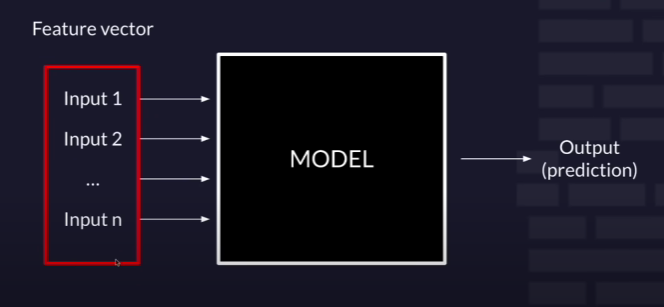
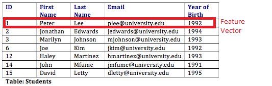
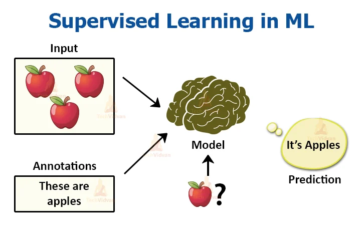
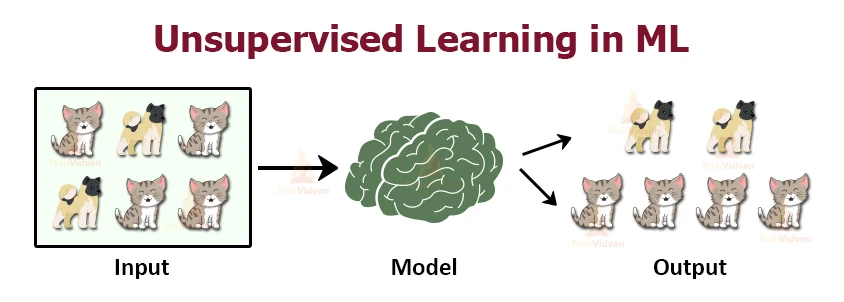
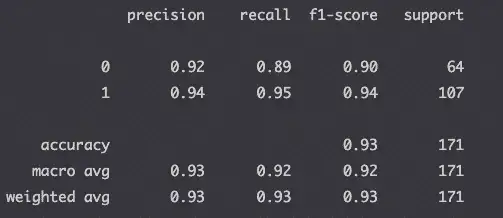
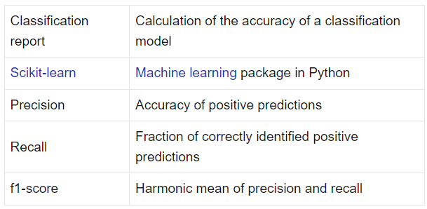
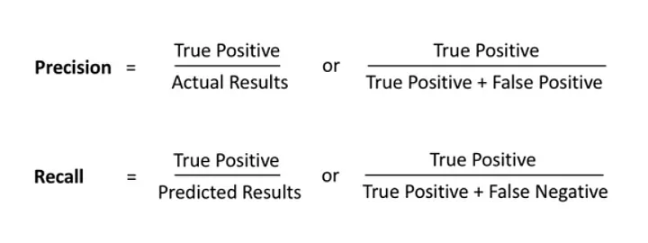

# Machine Learning

Machine learning is a subdomain of Computer Science that focuses on algorithms which help
a computer learn from data without explicit programming.

## AI vs ML vs DS
* **Artificial Intelligence** is an area of Computer Science where the goal is to enable computers
    and machines to perform human-like tasks and simulate human behaviour.
    It involves various techniques, including Machine Learning, to achieve this goal.
    * **Machine Learning** is a subset of AI that tries to solve a specific problem and make predictions using data.
     It leverages statistical and mathematical techniques to analyze and extract patterns from datasets.
* **Data Science** is a field that attemps to find patterns and draw insights from data. 
    It's a multidisciplinary field that combines scientific methods, processes, algorithms, and systems 
    to extract knowledge and insights from structured and unstructured data. It involves various techniques,
    including Machine Learning, to analyze and interpret data to solve complex problems and make informed decisions.

! All fields overlap and all may use ML

## Features

1. Qualitative - categorical data (finite number of categories or groups). 
    * nominal data (with no inherent order). Examples: female/male, countries, etc
        * ONE-HOT ENCODING: If it matches make it 1, if not make it 0.
    * ordinal data (with order). Examples: states of humor, states of life
      *  You can use numbers, i.e. 'How is your humor being 1 pretty bad and 10 pretty happy?'
2. Quantitive - numerical valued data (could be discrete or continuous)

## Types of ML

1. **Supervised learning** - uses labeled inputs (meaning the input has a corresponding output label)
    to train models and learn outputs.

    The goal is to learn a mapping or relationship between the input data and the output labels. 
    The learning algorithm uses this labeled data to make predictions or classify new, unseen data points. 

    Examples: linear regression, decision trees, and support vector machines.

    Commonly used in tasks such as classification, regression, and prediction, where the target variable is known.
2. **Unsupervised learning** - deals with unlabeled data, where there are no predefined output labels. 
 
   The goal is to discover patterns, structures, or relationships within the data. 
   The algorithm learns to identify similarities, group similar data points, or reduce the dimensionality of the data. 

    Examples: clustering algorithms (k-means, hierarchical), and dimensionality reduction techniques (PCA, t-SNE).

    Commonly used for exploratory data analysis, pattern recognition, and gaining insights from unstructured or unlabeled data.
3. **Reinforcement Learning**: it's a type of learning where an agent learns to make decisions and take actions in an environment 
    to maximize a cumulative reward or achieve a specific goal. In reinforcement learning, there is no labeled data or explicit supervision. 
    Instead, the agent learns through trial and error by interacting with the environment. It receives feedback in the form of rewards or penalties based on its actions, 
    which helps the agent learn optimal behaviors through a process of exploration and exploitation. 

    Commonly used in scenarios like robotics, game playing, autonomous systems, and decision-making problems.

### Supervised learning

#### Supervised learning tasks
1. Classification - predict discrete classes
   * Binary classification: This task involves classifying instances into two categories. positive/negative, true/false, spam/not spam, cat/dog
   * Multiclass classification: The goal is to assign instances to multiple classes. cat/dog/lizard/dolphin, orange/apple/pear, plant species
2. Regression - predict continuous values. Examples include:
   * Predicting the price of a house based on its features like area, number of rooms, etc.
   * Forecasting the sales of a product based on historical data and other relevant factors.
   * Estimating the age of a person based on various demographic features.

#### Dataset
* Training dataset.

The training dataset is the initial set of labeled data used to train a machine learning model. 
It consists of input features (also known as independent variables) and their corresponding target values (also known as dependent variables or labels).

In the context of machine learning, loss (also known as the cost or objective function) is a measure of how well a machine learning model is performing on the training dataset. 
It quantifies the discrepancy between the predicted outputs of the model and the actual target values in the training data.
During the training process, the model tries to minimize the loss function by adjusting its internal parameters or weights. 
The goal is to find the set of parameters that yields the lowest possible loss, indicating a better fit to the training data.

* Validation set. It's used as a reality check during/after training to ensure that the model can ahndle unseen data.
* Testing dataset. It's used to check how generalizable the final chosen model is.

### Unsupervised learning

# Code

## Classification Report Metrics Interpretation

* The precision tells us the accuracy of positive predictions.
    * When we predict True, how often is it really True? This number should be as high as possible.
    * High precision: Not many True values were predicted as False
* The recall, also named sensivity, or hit rate, tells us the fraction of correctly identified positive predictions.
    * What fraction of the True predictions were actually True?This number should be as high as possible. 
    * High recall: Predicted most True values correctly.
* The f1-score, or F measure, measures precision and recall at the same time by finding the harmonic mean of the two values.
* The accuracy measures the accuracy of all predictions (positive and negative).
    * Accuracy should be as high as possible.

