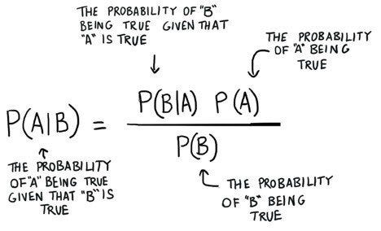
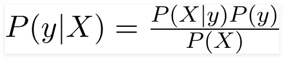
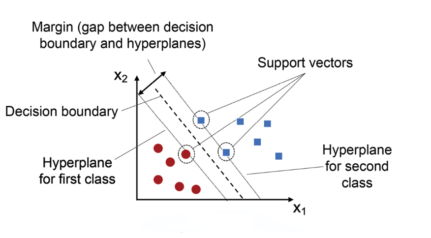

# Supervised Learning

## Classification

### K-Nearest Neighbor (KNN)

The k-nearest neighbors algorithm, also known as KNN or k-NN, is a non-parametric, supervised learning classifier, 
which uses proximity to make classifications or predictions about the grouping of an individual data point. 
While it can be used for either regression or classification problems, it is typically used as a classification algorithm,
working off the assumption that similar points can be found near one another.

STEPS:
* Step-1: Select the number K of the neighbors
* Step-2: Calculate the Euclidean distance of K number of neighbors
* Step-3: Take the K nearest neighbors as per the calculated Euclidean distance.
* Step-4: Among these k neighbors, count the number of the data points in each category.
* Step-5: Assign the new data points to that category for which the number of the neighbor is maximum.

### Naive Bayes

Using Bayes theorem, we can find the probability of A happening, given that B has occurred. 
Here, B is the evidence and A is the hypothesis. 
The assumption made here is that the predictors/features are independent. 
That is presence of one particular feature does not affect the other. Hence it is called naive.

If I consider for example this dataset:

We classify whether the day is suitable for playing golf, given the features of the day. 
The columns represent these features and the rows represent individual entries. 

We make two assumptions here:
1. We consider that these predictors are independent. That is, if the temperature is hot, it does not necessarily mean that the humidity is high. 
2. All the predictors have an equal effect on the outcome. That is, the day being windy does not have more importance in deciding to play golf or not.

The variable y is the class variable (play golf), which represents if it is suitable to play golf or not given the conditions. 
Variable X represent the parameters/features. We can rewrite Bayes:

Here X = (x1,x2, ..., xn) represent the features, i.e they can be mapped to outlook, temperature, humidity and windy. 
By substituting for X and expanding using the chain rule we get,

For all entries in the dataset, the denominator does not change, it remain static. 
Therefore, the denominator can be removed and a proportionality can be introduced.
* Symbol “∝” stands for 'is proportional to'
* Symbol “∏” (capital Pi) stands for 'repeated multiplication'. It's the multiplication equivalent of sigma 

**MAP: Maximum A Posteriori**

Pick the k which is the most probable

### Logistic Regression

Logistic Regression is used when the dependent variable(target) is categorical.
For example,
* To predict whether an email is spam (1) or (0)
* Whether the tumor is malignant (1) or not (0)

Logistic regression is a data analysis technique that uses mathematics to find the relationships between two data factors. 
It then uses this relationship to predict the value of one of those factors based on the other. 

The Logistic Regression uses a cost function can be defined as the ‘Sigmoid function’ or also known as the ‘logistic function’ instead of a linear function.

### Support Vector Machine (SVM)
SVM or Support Vector Machine is a linear model for classification and regression problems. 
It can solve linear and non-linear problems and work well for many practical problems. 
The idea of SVM is simple: The algorithm creates a line or a hyperplane which separates the data into classes.

* Imagine you have a dataset with different data points, each belonging to one of two classes (e.g., red circles and blue squares). The goal of SVM is to find a line (in 2D) or a hyperplane (in higher dimensions) that best separates the data points of different classes.

* SVM finds this separation boundary by identifying support vectors, which are the data points closest to the decision boundary. These support vectors play a crucial role in defining the decision boundary.

* The decision boundary is positioned in a way that maximizes the margin, which is the distance between the decision boundary and the nearest data points of each class. SVM aims to find the decision boundary that achieves the largest margin, which provides better generalization and improves the model's ability to classify new, unseen data accurately.

* SVM can handle linearly separable data, where a straight line or hyperplane can perfectly separate the classes. However, SVM is also capable of handling non-linearly separable data by using a technique called the "kernel trick." The kernel trick transforms the data into a higher-dimensional space, where it becomes linearly separable. This allows SVM to find a decision boundary in the transformed space and make accurate classifications in the original space.

* Once the decision boundary is determined, SVM can classify new, unseen data points by examining which side of the decision boundary they fall on.

## Regression

### Linear Regression

Linear regression is a type of statistical analysis used to predict the relationship between two variables. 
It assumes a linear relationship between the independent variable and the dependent variable, and aims to find the best-fitting line that describes the relationship. 
The line is determined by minimizing the sum of the squared differences between the predicted values and the actual values.

#### Simple Linear Regression

In a simple linear regression, there is one independent variable and one dependent variable. 
The model estimates the slope and intercept of the line of best fit, which represents the relationship between the variables. 
The slope represents the change in the dependent variable for each unit change in the independent variable, while the intercept represents the predicted value of the dependent variable when the independent variable is zero.

#### Assumptions of Linear Regression

1. Linearity of residuals: There needs to be a linear relationship between the dependent variable and independent variable(s).
